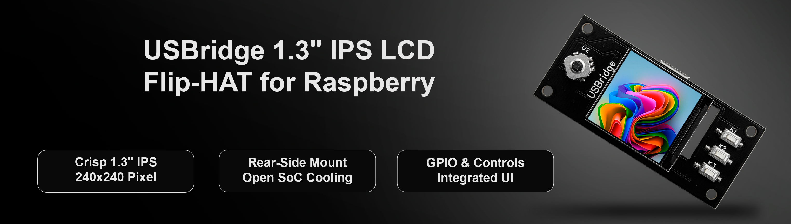
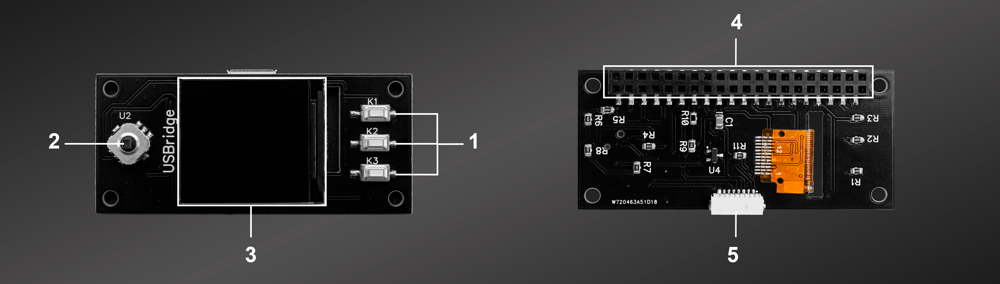

# USBridge Flip-HAT 1.3" IPS LCD for Raspberry Pi Zero

The **USBridge Flip-HAT** is a professional rear-mount terminal designed specifically for the Raspberry Pi Zero family. This module offers a vibrant display interface while maintaining full system cooling and GPIO access.

## Technical Specifications
- **Display:** 1.3-inch HD IPS (240x240 pixels)
- **Interface:** 4-wire SPI (Driver IC: ST7789)
- **Controls:** Integrated 5-way Joystick (U2) + 3x Tactile Buttons (K1, K2, K3)
- **Form Factor:** Rear-mount (Optimized for SoC cooling)
  

## Pinout Mapping
| Component | Function | BCM Pin / Connection |
|-----------|----------|----------------------|
| LCD       | SPI      | Standard SPI Pins    |
| Joystick  | 5-way    | Up, Down, Left, Right, Center Click |
| Buttons   | User-def | K1, K2, K3 |
| Header    | 40-Pin   | Female (Pass-through access) |

## Hardware Design Pillars
- **Thermal Freedom:** Unique back-side mounting keeps the SoC unobstructed for heatsinks.
- **Visual Clarity:** Premium IPS panel with wide viewing angles.
- **Enhanced UI:** Dedicated hardware controls for complex menu navigation.

## Hardware Components

The hardware design is open for community use. You can find all necessary production files in the `/Gerber` directory.

### Production Files
- **Gerber Files:** Located in `/Gerber`. Ready for PCB fabrication (Standard 2-layer, 1.6mm thickness recommended).

### Key Components Reference
- **Display:** 1.3" IPS LCD (ST7789 Driver)
- **Joystick:** 5-way navigation switch
- **Buttons:** 3x SMD tactile switches
- **Header:** 40-pin female connector for RPi Zero
---
Designed by **USBridge** in Spain.
